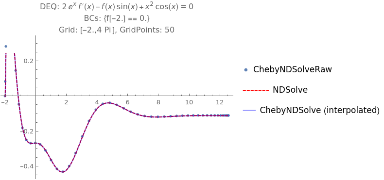
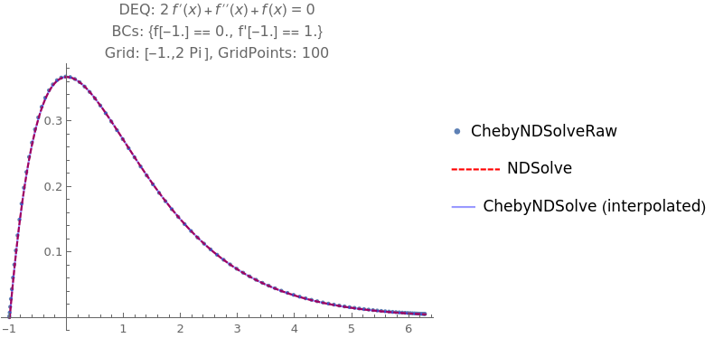
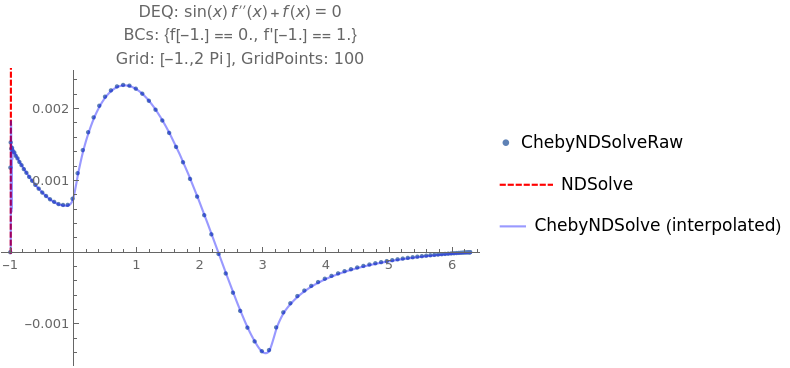

# Mathematica Package: ChebyshevSolver

This is a package for using the Pseudospectral method and a Chebyshev grid.
I developed it during my PhD time at the University of Alabama.

Author: Marco Knipfer
Institution: University of Alabama
Year: 2020

# Features and Restrictions
The package still has many restrictions, but it's enough for now

- solve first and second order ODEs for some intervall `[x0,x1]`
- boundary conditions:
	- have to be at boundary of intervall `[x0,x1]`
	- first order: one Dirichlet boundary condition or one Neumann boundary condition
	- second order:
		- two Dirichlet boundary condition
		- or one Dirichlet and one Neumann boundary condition
		- two Neumann boundary conditions not implemented!

# Usage
The idea is that one can just replace `NDSolve` with `ChebyNDSolve`.
Note that none of the options for `NDSolve` are implemented.
For a working example see the file `Tests/UseChebyshevSolver.wls`

- Import the package: <<"pathToPackage`"
- Set up differential equation, an intervall `[x0, x1]` in which the DEQ is to be solved and boundary conditions (for second order: `{bc1, bc2}`. Currently the conditions have to be on the boundary of the intervall (at `x0` or `x1`).

Example: Sin
```mathematica
DEQ =  f[x] + f''[x] == 0 ;
x0 = 0.;
x1 = 2 Pi;
bc1 = f[x0] == 0.;
bc2 = f'[x0] == 1.;
chebPoints = 50;

sol = ChebyshevSolver`ChebyNDSolve[{DEQ, bc1, bc2}, f, {x,x0,x1}, "GridPoints"->chebPoints];
plot = Plot[sol[x], {x,x0,x1}]
```

# Some Plots






# ToDo
- Setting of number of digits to keep in whole calculation
- boundary conditions at inner points
